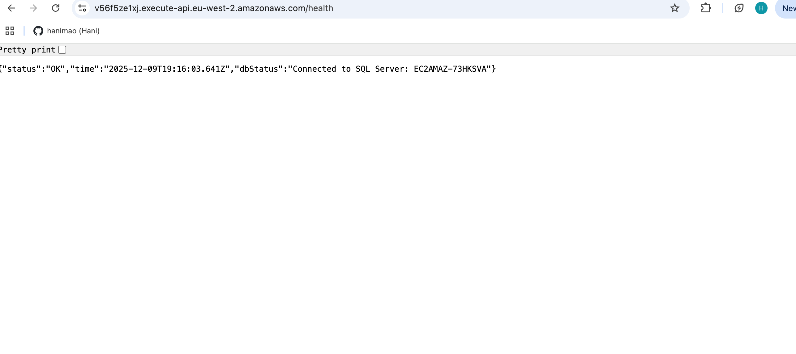
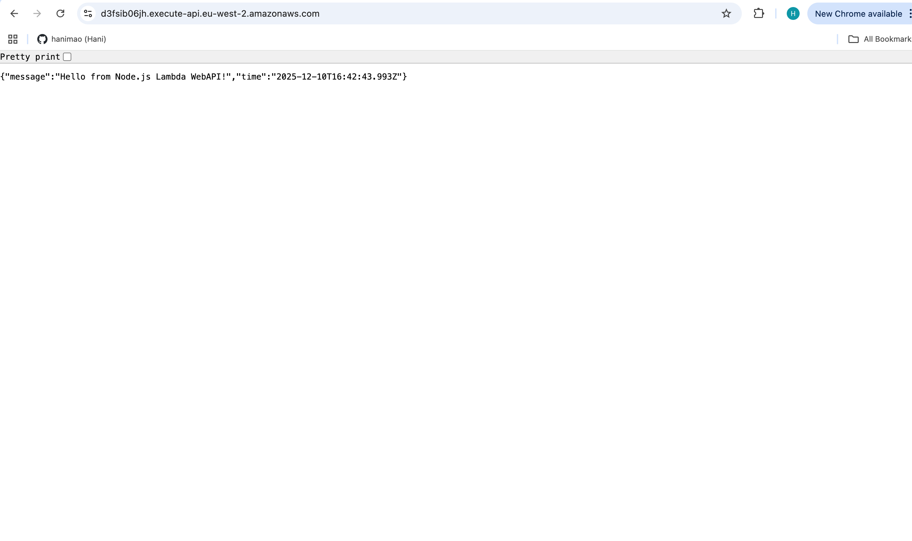

# Project Overview

This repository deploys a Node.js WebAPI app and a SQL Server database on AWS. It also includes a CI/CD pipeline using GitHub Actions to automate deployment of code changes to the API. The infrastructure is designed to be modular, scalable, and extendable for future enhancements. Lambda was used to host the Node.js WebAPI and the API Gateway exposes HTTP endpoints for the Lambda function. 

---

# Key Features 


This project demonstrates a **serverless Node.js WebAPI** deployed on AWS using **Terraform**.  
 
1. **S3 Bucket**
   - Stores the deployment ZIP (`deployment.zip`) for Lambda
2. **AWS Lambda Function**
   - Pulls the deployment ZIP from S3 during first deployment
   - Executes both `/` and `/health` routes
3. **API Gateway**
   - Routes HTTP requests to Lambda
4. **RDS SQL Server**
   - Stores application data
   - Used by `/health` route to verify connectivity
5. **Security Groups & VPC**
   - Ensures Lambda and RDS can communicate securely
6. **GitHub Actions**
   - updates Lambda automatically on code changes 


---

# Directory Structure

```text

serverless/
├── infra/
│   ├── environments/
│   │   ├── dev/
│   │   │   ├── backend.tf
│   │   │   ├── component.tf
│   │   │   ├── main.tf
│   │   │   ├── oidc.tf
│   │   │   ├── outputs.tf
│   │   │   └── variables.tf
│   │   └── prod/
│   └── modules/
│       ├── api/
│       ├── database/
│       ├── lambda/
│       └── networking/
├── src/
│   └── handler/
│       ├── node_modules/
│       ├── index.js
│       ├── package-lock.json
│       └── package.json
├── .gitignore
├── .pre-commit-config
└── README.md
   
```

---

# Architecture  


---

# Workflow

### API Routes

| Route       | Method | Description |
|------------|--------|-------------|
| `/`        | GET    | Returns a welcome message with timestamp |
| `/health`  | GET    | Checks SQL Server connectivity and returns status |


### Root Route `/`


1. User requests `GET /` 
2. API Gateway receives the request and packages it into an **event payload**
3. Lambda is invoked with the event payload.  
4. Lambda inspects `event.requestContext.http.path` and identifies `/`.  
5. Lambda executes root route logic:
   - Generates JSON with a greeting and current timestamp.
6. Lambda returns response to API Gateway.  
7. API Gateway sends JSON back to the client


### Health Route `/health`


1. User requests `GET /health`  
2. API Gateway receives the request and packages it into an **event payload**
3. Lambda is invoked with the event payload.  
4. Lambda inspects `event.requestContext.http.path` and identifies `/health`.  
5. Lambda reads database environment variables:DB_HOST, DB_USER, DB_PASS, DB_NAME, DB_PORT, DB_SECRET_ARN
6. Lambda connects to the RDS SQL Server using the credentials. 
7. Lambda executes a test query
8. API Gateway returns the JSON response to the client.

---

# CI/CD Pipeline

When application code is modified and pushed to GitHub, the CI/CD pipeline automatically updates the Lambda function with the latest version of the code:

1. A code change is pushed to the GitHub repository.
- A GitHub Actions workflow is triggered.
2. Installs Node.js
3. Builds a new deployment.zip file containing the Lambda application code
4. The pipeline uploads the new ZIP file to the S3 bucket that was created by Terraform during initial setup.
5. After the ZIP is uploaded, the workflow calls AWS to update the Lambda function’s code, instructing Lambda to pull the latest ZIP from S3.
6. Lambda immediately switches to the new code, meaning all API Gateway requests (`/` and `/health`) begin using the updated Lambda logic without any downtime.

---

### **Here's what it will look like**





